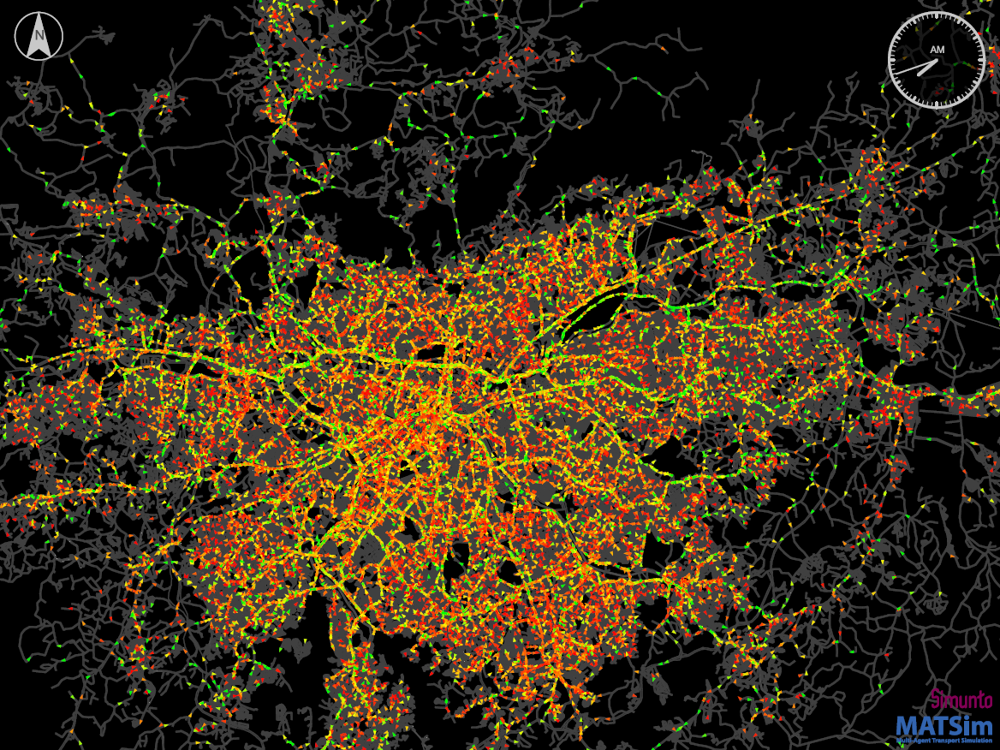

# An open synthetic population of Sao Paulo Metropolitan Region

This repository contains the code to create an open data synthetic population
of the Sao Paulo Metropolitan region. It can also be used to
create scenarios for other regions in Brasil, given that an appropriate household 
travel survey is available.

- [How to use this pipeline to create your own scenario](docs/howto.md)
- [How to run a MATSim transport simulation for Sao Paulo Metropolitan Region](docs/howto.md)

## Scenario download

In case you wish to use the generated synthetic travel demand or agent-based scenario directly, they are available here:

- [Synthetic travel demand](https://polybox.ethz.ch/index.php/s/JPASnSItJNwJb7J?path=%2FSynthetic%20Travel%20Demand)
- [Runnable eqasim Scenario](https://polybox.ethz.ch/index.php/s/JPASnSItJNwJb7J) The files are located in the zipped file called Simulation_input100pct.zip.

The scenario is created using this repository with the version 1.0.

## Main reference

The main research reference for the general pipeline methodology is:
> Hörl, S. and M. Balac (2020) [Reproducible scenarios for agent-based transport simulation: A case study for Paris and Île-​de-France](https://www.researchgate.net/publication/341131284_Reproducible_scenarios_for_agent-based_transport_simulation_A_case_study_for_Paris_and_Ile-de-France), Arbeitsberichte Verkehrs-und Raumplanung, 1499, IVT, ETH Zurich, Zurich.

The main research reference for the Sao Paulo synthetic population is:
> Sallard, A., M. Balac and S. Hörl (2020) [An agent-based scenario for the Sao Paulo Metropolitan Region](https://www.researchgate.net/publication/342735196_An_agent-based_scenario_of_the_Greater_Sao_Paulo_Metropolitan_Region), Arbeitsberichte Verkehrs-und Raumplanung, xxx, IVT, ETH Zurich, Zurich.

## What is this?

This repository contains the code to create an open data synthetic population
of the Sao Paulo Metropolitan region.
It takes as input several publicly
available data sources to create a data set that closely represents the
socio-demographic attributes of persons and households in the region, as well
as their daily mobility patterns. Those mobility patterns consist of activities
which are performed at certain locations (like work, education, shopping, ...)
and which are connected by trips with a certain mode of transport. It is known
when and where these activities happen.

Such a synthetic population is useful for many research and planning applications.
Most notably, such a synthetic population serves as input to agent-based
**transport simulations**, which simulate the daily mobility behaviour of people
on a spatially and temporally detailed scale. Moreover, such data has been used
to study the **spreading of diseases**, or the **placement of services** and facilities.

The synthetic population for Sao Paulo can be generated from scratch by
everybody who has basic knowledge in using Python. Detailed [instructions
on how to generate a synthetic population with this repository](docs/howto.md) are available.

Although the synthetic population is independent of the downstream application
or simulation tool, we provide the means to create an input population for the
agent- and activity-based transport simulation framework [MATSim](https://matsim.org/).

This pipeline has been adapted to many other regions and cities around the world
and is under constant development. It is released under the GPL license, so feel free
to make adaptations, contributions or forks as long as you keep your code open
as well!

## Publications
- Sallard, A., M. Balac and S. Hörl (2020) [An agent-based scenario for the Sao Paulo Metropolitan Region](), Arbeitsberichte Verkehrs-und Raumplanung, xxx, IVT, ETH Zurich, Zurich.
- Hörl, S. and M. Balac (2020) [Reproducible scenarios for agent-based transport simulation: A case study for Paris and Île-de-France](https://www.researchgate.net/publication/341131284_Reproducible_scenarios_for_agent-based_transport_simulation_A_case_study_for_Paris_and_Ile-de-France), Preprint, IVT, ETH Zurich, Zurich.
- Hörl, S., Balac, M. and Axhausen, K.W. (2019) [Dynamic demand estimation for an AMoD system in Paris](https://ieeexplore.ieee.org/document/8814051),
paper presented at the 30th IEEE Intelligent Vehicles Symposium, Paris, June 2019.
